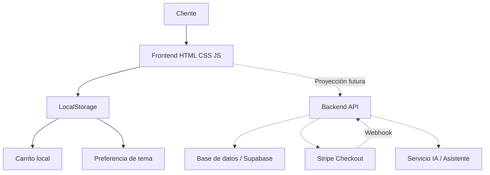
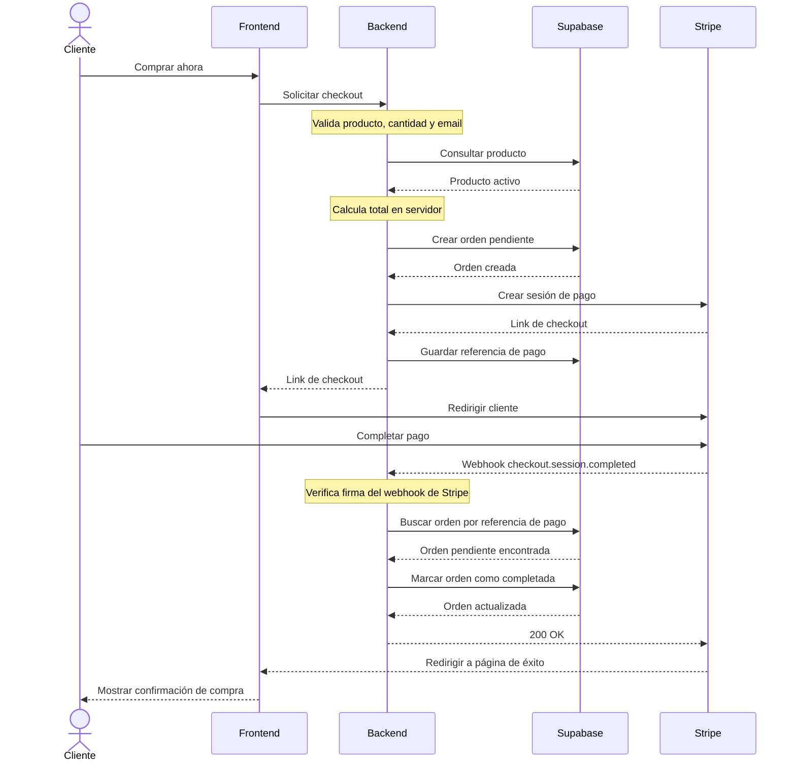

# Bertolli Pro 900

Landing page premium para **Bertolli Pro 900**, una cocina a gas profesional ficticia de 5 hornillas.

El proyecto fue desarrollado como una prueba técnica frontend usando **HTML5, CSS3 y JavaScript vanilla**, sin frameworks externos como React, Vue, Next.js, Tailwind, Bootstrap o jQuery.

La entrega principal es una experiencia frontend estática, responsive, accesible y funcional. También se incluyen diagramas de arquitectura y secuencia como **proyección técnica futura** para mostrar cómo podría evolucionar la landing hacia una solución con backend, base de datos y pagos.

---

## Tecnologías usadas

* HTML5 semántico
* CSS3
* JavaScript vanilla
* LocalStorage
* Mermaid para diagramas técnicos
* Assets locales optimizados

---

## Características principales

La landing incluye:

* Header responsive
* Hero principal con imagen del producto
* Call-to-action principal
* Sección de características
* Galería con lightbox
* Tabla de especificaciones técnicas
* Comparador de producto
* Testimonios
* FAQ tipo accordion
* Formulario de cotización local
* Footer informativo
* Modo claro / oscuro
* Carrito local con LocalStorage
* Asistente flotante de producto con respuestas locales
* Diseño responsive para mobile, tablet, laptop y desktop
* Estados accesibles con ARIA, `aria-live`, `aria-expanded`, `role="status"` y foco visible

---

## Estructura del proyecto

```txt
/
├── index.html
├── css/
│   └── styles.css
├── js/
│   ├── main.js
│   ├── cart.js
│   └── assistant.js
├── assets/
│   ├── icons/
│   │   └── favicon.svg
│   └── img/
│       ├── bertolli-pro-900-hero.jpg
│       ├── gallery-burners.svg
│       ├── gallery-controls.svg
│       ├── gallery-oven.svg
│       ├── gallery-grates.svg
│       └── gallery-kitchen.svg
├── docs/
│   └── diagrams/
└── README.md
```

> Nota: la carpeta `docs/diagrams/` contiene diagramas de arquitectura y secuencia usados como documentación de evolución futura del proyecto.

---

## Cómo ejecutar el proyecto

Opción directa:

```bash
start index.html
```

O abriendo manualmente el archivo:

```txt
index.html
```

Opción recomendada con servidor estático:

```bash
python -m http.server 4173
```

Luego abrir:

```txt
http://localhost:4173
```

---

## Funcionalidades frontend

### Modo claro / oscuro

El proyecto incluye cambio de tema entre modo claro y oscuro.

* Usa `data-theme="light"` y `data-theme="dark"` en el elemento `<html>`.
* Guarda la preferencia del usuario en `localStorage`.
* Actualiza atributos accesibles como `aria-pressed` y `aria-label`.
* Mantiene contraste legible en ambas versiones.

---

### Galería y lightbox

La galería permite visualizar imágenes del producto y sus detalles.

Incluye:

* Grid responsive
* Botón para expandir galería
* Lightbox
* Controles anterior / siguiente
* Cierre con botón
* Cierre con tecla `Escape`
* Imágenes con textos alternativos

---

### FAQ interactivo

La sección de preguntas frecuentes funciona como accordion accesible.

Incluye:

* `aria-expanded`
* `aria-controls`
* Regiones asociadas con `aria-labelledby`
* Navegación con teclado
* Respuestas ocultas/visibles mediante JavaScript

---

### Carrito local

El carrito funciona completamente en frontend usando `localStorage`.

Incluye:

* Botón “Agregar al carrito”
* Contador en el header
* Cantidad del producto
* Incrementar cantidad
* Disminuir cantidad
* Limpiar carrito
* Cálculo de subtotal
* Mensajes de feedback
* Botón de compra con fallback hacia la sección de cotización

No requiere backend, base de datos ni pasarela de pagos para funcionar.

---

### Formulario de cotización

El formulario de cotización funciona como interacción local.

Incluye:

* Validación HTML
* Campos requeridos
* Mensaje de éxito local
* `role="status"` y `aria-live="polite"` para feedback accesible

En esta entrega no se envían datos a ningún backend.

---

### Asistente de producto

El proyecto incluye un asistente flotante de producto.

El asistente responde localmente usando un pequeño corpus sobre:

* Precio
* Garantía
* Dimensiones
* Materiales
* Potencia
* Limpieza
* Instalación
* Tipo de gas
* Beneficios del producto

También incluye:

* Botón flotante
* Panel de chat
* Formulario de mensaje
* Respuestas locales
* Fallback si no reconoce una pregunta
* Cierre con botón
* Cierre con tecla `Escape`

No requiere backend ni API externa.

---

## Accesibilidad

Se aplicaron mejoras de accesibilidad como:

* HTML semántico
* `lang="es"`
* `aria-label` en botones e interacciones
* `aria-expanded` en accordions
* `aria-controls` en elementos desplegables
* `aria-live` para mensajes dinámicos
* `role="status"` en mensajes de feedback
* Textos alternativos en imágenes
* Estados `focus-visible`
* Compatibilidad con `prefers-reduced-motion`
* Botones con nombres accesibles
* Interacciones usables con teclado

---

## Responsive design

La landing fue ajustada para distintos tamaños de pantalla:

* Mobile pequeño
* Mobile estándar
* Tablet
* Laptop
* Desktop
* Pantallas grandes

Se usaron técnicas como:

* Grids flexibles
* `clamp()`
* `minmax()`
* Media queries
* Layouts fluidos
* Apilamiento de cards en mobile
* Scroll horizontal controlado en tablas
* Lightbox adaptable
* Asistente flotante adaptable en pantallas pequeñas

---

## Proyección de arquitectura

Aunque la entrega actual funciona como frontend estático, se incluyeron diagramas técnicos como documentación de una posible evolución del producto.

Esta arquitectura futura contempla:

* Frontend estático
* Backend API
* Base de datos
* Pasarela de pagos
* Webhooks
* Confirmación de órdenes

La intención de estos diagramas es mostrar criterio técnico y visión de crecimiento, no indicar que dichas integraciones sean obligatorias para ejecutar la entrega actual.

---

## Diagrama de arquitectura proyectada



---

## Diagrama de secuencia proyectado para checkout



---

## Qué funciona actualmente sin backend

* Landing completa
* Modo claro / oscuro
* Galería
* Lightbox
* FAQ accordion
* Carrito local con LocalStorage
* Formulario con feedback local
* Asistente de producto con respuestas locales
* Responsive mobile/desktop
* Accesibilidad base
* Navegación interna con scroll suave

---

## Qué queda como evolución futura

Con más tiempo, el proyecto podría evolucionar hacia:

* Backend real para leads
* Persistencia de órdenes
* Integración con Supabase
* Stripe Checkout real
* Webhooks de pago
* Panel administrativo
* Historial de conversaciones del asistente
* Asistente conectado a un modelo IA externo
* Tests automatizados con Playwright
* Auditoría Lighthouse automatizada

---

## Decisiones de diseño

* Estética premium con tonos oscuros, dorados y superficies tipo acero.
* Hero visual fuerte para comunicar producto de alta gama.
* Cards con sombras, bordes sutiles y hover states.
* Galería pensada para enseñar detalles antes de cotizar.
* Tablas claras para especificaciones y comparación.
* Footer informativo con contacto, redes y enlaces legales ficticios.

---

## Decisiones técnicas

* Se mantuvo el frontend en JavaScript vanilla por simplicidad y cumplimiento de la prueba.
* Se separaron las responsabilidades en archivos distintos:

  * `main.js` para interacciones generales.
  * `cart.js` para carrito local.
  * `assistant.js` para asistente de producto.
* El carrito usa `localStorage` para persistir cantidades.
* El modo oscuro usa `localStorage` para persistir la preferencia del usuario.
* El formulario no envía datos reales en esta entrega.
* El asistente responde localmente sin depender de APIs externas.
* Los diagramas documentan una proyección futura sin convertirla en dependencia del frontend actual.

---

## Uso de IA

La IA fue utilizada como apoyo para:

* Organizar la estructura del proyecto.
* Mejorar copy y documentación.
* Proponer una arquitectura futura.
* Revisar accesibilidad.
* Pulir interacciones frontend.
* Generar diagramas de arquitectura y secuencia.

El código fue revisado y ajustado manualmente para mantener una entrega frontend funcional, estática y entendible.

---

## Checklist manual

Antes de entregar se recomienda verificar:

* [ ] La página carga sin errores en consola.
* [ ] El header funciona correctamente en mobile y desktop.
* [ ] El modo oscuro cambia y persiste.
* [ ] Los botones del hero funcionan.
* [ ] La galería abre el lightbox.
* [ ] El lightbox cierra con botón y con `Escape`.
* [ ] El FAQ abre y cierra respuestas.
* [ ] El carrito agrega productos.
* [ ] El carrito actualiza cantidad y subtotal.
* [ ] El botón de checkout lleva a cotización.
* [ ] El formulario muestra feedback local.
* [ ] El asistente abre, cierra y responde.
* [ ] No hay overflow horizontal en mobile.
* [ ] Las tablas se pueden consultar en pantallas pequeñas.
* [ ] Las imágenes tienen `alt`.
* [ ] Los estados de foco son visibles.

---

## Estado del proyecto

Entrega frontend estática completada con documentación de proyección arquitectónica.
