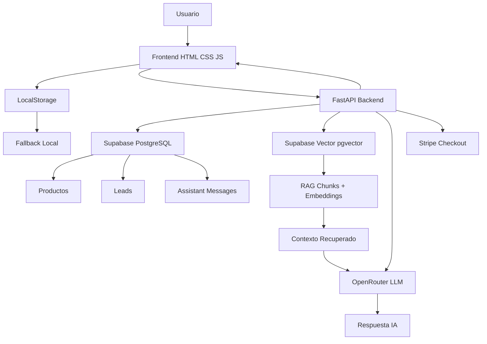
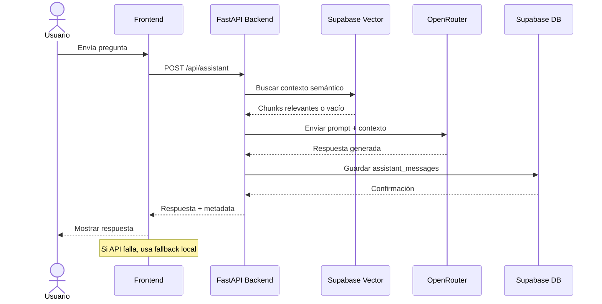
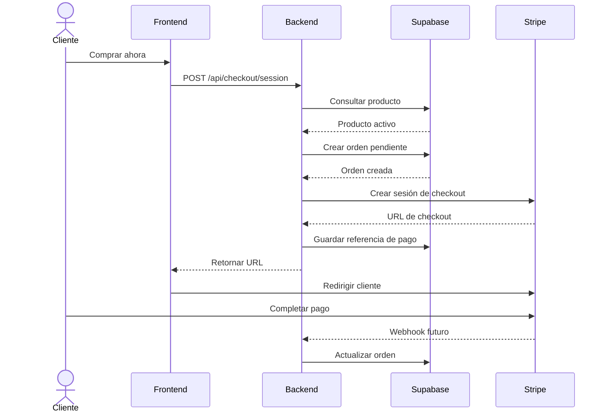

# Bertolli Pro 900

Landing page premium y arquitectura full-stack progresiva para **Bertolli Pro 900**, una cocina a gas profesional ficticia de 5 hornillas.

El proyecto nació como una prueba técnica frontend usando **HTML5, CSS3 y JavaScript vanilla**, sin frameworks externos como React, Vue, Next.js, Tailwind, Bootstrap o jQuery. Posteriormente fue evolucionado a una estructura full-stack organizada por stacks, manteniendo la landing completamente funcional incluso si el backend o los servicios externos no están disponibles.

La solución actual combina:

* Frontend estático responsive.
* Backend con FastAPI.
* Supabase como base de datos PostgreSQL.
* Supabase Vector con `pgvector` para RAG.
* OpenRouter para enrutamiento de modelos IA.
* Preparación para Stripe Checkout.
* Fallback local para carrito, formulario y asistente.
* Configuración de despliegue en Render.

---

## Estado actual del proyecto

El proyecto funciona como una landing estática premium con integraciones progresivas.

Esto significa que:

* El frontend puede abrirse y usarse sin backend.
* Si el backend está activo, el frontend consume APIs reales.
* Si el backend está caído, el frontend conserva fallback local.
* Si OpenRouter falla, el backend mantiene fallback controlado.
* Si Supabase Vector no devuelve contexto, el asistente puede usar corpus local.
* Si Stripe no está configurado, el flujo de compra cae a cotización/contacto.

El objetivo fue construir una entrega sólida, defendible y resiliente, no una integración frágil que se rompa si un servicio externo falla.

---

## Tecnologías usadas

### Frontend

* HTML5 semántico.
* CSS3.
* JavaScript vanilla.
* LocalStorage.
* ARIA para accesibilidad.
* Mermaid para diagramas técnicos.
* Assets locales optimizados.

### Backend

* Python.
* FastAPI.
* Uvicorn.
* Pydantic / Pydantic Settings.
* HTTPX.
* Supabase Python Client.
* Stripe SDK.
* Sentence Transformers.
* NumPy.
* PyPDF.
* Python Multipart.

### Base de datos y RAG

* Supabase.
* PostgreSQL.
* `pgvector`.
* Funciones RPC para búsqueda vectorial.
* Tabla de documentos RAG.
* Tabla de chunks con embeddings.
* Modelo de embeddings `sentence-transformers/all-MiniLM-L6-v2`.
* Embeddings de dimensión 384.

### IA

* OpenRouter.
* Modelo primario configurable.
* Modelo fallback configurable.
* Enhancement model preparado pero desactivado por defecto.
* Judge model preparado pero desactivado por defecto.
* Fallback local para estabilidad.

### Pagos

* Stripe Checkout preparado.
* Variables de entorno para secret key, price id, success URL y cancel URL.
* Fallback a cotización si Stripe no está configurado.

### Despliegue

* Render Static Site para frontend.
* Render Web Service para backend.
* `render.yaml` incluido.
* Variables sensibles configurables desde el dashboard de Render.

---

## Estructura del proyecto

```txt
/
├── frontend/
│   ├── index.html
│   ├── css/
│   │   └── styles.css
│   ├── js/
│   │   ├── config.js
│   │   ├── main.js
│   │   ├── cart.js
│   │   └── assistant.js
│   ├── assets/
│   │   ├── icons/
│   │   └── img/
│   └── docs/
│       └── diagrams/
│
├── backend/
│   ├── app/
│   │   ├── main.py
│   │   ├── core/
│   │   │   └── config.py
│   │   ├── routers/
│   │   │   ├── assistant.py
│   │   │   ├── checkout.py
│   │   │   ├── health.py
│   │   │   ├── leads.py
│   │   │   ├── orders.py
│   │   │   ├── products.py
│   │   │   └── rag.py
│   │   └── services/
│   │       ├── ai_router.py
│   │       ├── assistant_service.py
│   │       ├── embedding_service.py
│   │       ├── rag_service.py
│   │       ├── stripe_service.py
│   │       └── supabase_service.py
│   │
│   ├── supabase/
│   │   ├── README.md
│   │   ├── schema.sql
│   │   ├── vector_schema.sql
│   │   ├── policies.sql
│   │   └── seed.sql
│   │
│   ├── requirements.txt
│   ├── .env.example
│   └── README.md
│
├── render.yaml
├── README.md
└── .gitignore
```

---

## Características principales del frontend

La landing incluye:

* Header responsive.
* Hero principal con imagen del producto.
* Call-to-action principal.
* Sección de características.
* Galería con lightbox.
* Tabla de especificaciones técnicas.
* Comparador de producto.
* Testimonios.
* FAQ tipo accordion.
* Formulario de cotización.
* Footer informativo.
* Modo claro / oscuro.
* Carrito local con LocalStorage.
* Asistente flotante de producto.
* Diseño responsive para mobile, tablet, laptop y desktop.
* Estados accesibles con ARIA.
* Foco visible.
* Compatibilidad con `prefers-reduced-motion`.

---

## Características principales del backend

El backend expone una API con FastAPI para convertir la landing en una experiencia full-stack progresiva.

Endpoints principales:

```txt
GET  /health
GET  /api/health

GET  /api/products
GET  /api/products/{product_id}

POST /api/leads
POST /api/orders
POST /api/checkout/session

POST /api/assistant
GET  /api/assistant/models

GET  /api/rag/status
POST /api/rag/search
POST /api/rag/ingest-seed
```

---

## Flujo general del sistema

```txt
Usuario
  ↓
Frontend HTML/CSS/JS
  ↓
FastAPI Backend
  ↓
Supabase PostgreSQL
  ↓
Supabase Vector / pgvector
  ↓
OpenRouter IA
  ↓
Respuesta al usuario
```

El frontend no depende obligatoriamente del backend para renderizar. Las integraciones son progresivas.

---

## Arquitectura del asistente inteligente

El asistente funciona con una arquitectura resiliente:

```txt
Usuario pregunta
  ↓
Frontend intenta llamar POST /api/assistant
  ↓
Backend recibe mensaje
  ↓
Backend intenta recuperar contexto RAG
  ↓
Backend construye prompt con contexto
  ↓
Backend llama OpenRouter
  ↓
Si modelo principal falla, intenta fallback
  ↓
Si IA falla, usa fallback controlado
  ↓
Guarda conversación en Supabase
  ↓
Devuelve respuesta al frontend
```

El frontend solo usa su bot local si el backend está caído, tarda demasiado o devuelve un error no controlado.

---

## RAG con Supabase Vector

El proyecto incluye un flujo RAG basado en Supabase Vector.

### Tablas principales

```txt
rag_documents
rag_chunks
```

### Funcionamiento

```txt
Documento base
  ↓
Extracción de contenido
  ↓
División en chunks
  ↓
Generación de embeddings
  ↓
Almacenamiento en rag_chunks
  ↓
Búsqueda semántica con pgvector
  ↓
Contexto enviado al modelo IA
```

### Modelo de embeddings

```txt
sentence-transformers/all-MiniLM-L6-v2
```

Dimensión del embedding:

```txt
384
```

### Estado esperado del RAG

El endpoint:

```txt
GET /api/rag/status
```

debe retornar algo similar a:

```json
{
  "supabase_configured": true,
  "documents_count": 3,
  "chunks_count": 3,
  "chunks_with_embeddings_count": 3,
  "rag_ready": true,
  "error": null
}
```

### Búsqueda RAG

Ejemplo:

```powershell
Invoke-RestMethod `
  -Uri "http://127.0.0.1:8005/api/rag/search" `
  -Method Post `
  -ContentType "application/json; charset=utf-8" `
  -Body '{"query":"precio garantía instalación Bertolli Pro 900","match_count":5}'
```

---

## OpenRouter y modelos IA

El backend usa OpenRouter para conectarse a modelos LLM.

Variables principales:

```env
OPENROUTER_API_KEY=
OPENROUTER_BASE_URL=https://openrouter.ai/api/v1

CHAT_PRIMARY_LLM=openrouter/free
CHAT_FALLBACK_LLM=openrouter/free
CHAT_ENHANCEMENT_LLM=
CHAT_JUDGE_LLM=

CHAT_USE_FALLBACK=true
CHAT_USE_ENHANCEMENT=false
CHAT_USE_JUDGE=false
CHAT_TEMPERATURE=0.2
CHAT_TOP_P=0.8
CHAT_MAX_TOKENS=450
CHAT_TIMEOUT_MS=45000
```

### Decisión técnica

Se usa `openrouter/free` como opción práctica para reducir fallos por modelos gratuitos específicos que pueden cambiar de disponibilidad. Durante el desarrollo, algunos modelos con sufijo `:free` devolvían `No endpoints found`, por lo que se dejó un router flexible y fallback activo.

---

## Fallbacks del asistente

El sistema tiene varios niveles de protección:

### 1. Fallback de frontend

Se usa solo cuando el backend no responde o está caído.

### 2. Fallback de backend

Se usa cuando OpenRouter falla.

### 3. Fallback de RAG

Se usa cuando Supabase Vector no devuelve contexto útil.

### 4. Corpus local

Existe un corpus local básico para mantener respuestas mínimas sobre:

* Precio.
* Garantía.
* Dimensiones.
* Instalación.
* Materiales.
* Tipo de gas.
* Beneficios.

---

## Supabase

Supabase se usa para:

* Productos.
* Features.
* Especificaciones.
* Galería.
* FAQ.
* Leads.
* Órdenes.
* Mensajes del asistente.
* Documentos RAG.
* Chunks RAG.
* Embeddings vectoriales.

### Archivos SQL

El orden recomendado para crear la base es:

```txt
1. backend/supabase/schema.sql
2. backend/supabase/vector_schema.sql
3. backend/supabase/policies.sql
4. backend/supabase/seed.sql
```

### Tablas principales

```txt
products
product_features
product_specs
product_gallery
faq_items
leads
orders
assistant_messages
rag_documents
rag_chunks
```

---

## Stripe

El proyecto incluye preparación para Stripe Checkout.

Variables:

```env
STRIPE_SECRET_KEY=
STRIPE_PRICE_ID=
STRIPE_SUCCESS_URL=
STRIPE_CANCEL_URL=
```

Si `STRIPE_PRICE_ID` o `STRIPE_SECRET_KEY` no están configurados, el backend responde de forma controlada y el frontend puede caer a cotización/contacto.

Esta decisión evita que la demo se rompa si Stripe todavía no está completamente configurado.

---

## Variables de entorno

El backend usa `backend/.env` en local y variables configuradas en Render para producción.

Archivo base:

```txt
backend/.env.example
```

Ejemplo:

```env
PORT=8005
ALLOWED_ORIGINS=http://localhost:5500,http://127.0.0.1:5500,http://localhost:8005

SUPABASE_URL=
SUPABASE_ANON_KEY=
SUPABASE_SERVICE_ROLE_KEY=
DATABASE_URL=

STRIPE_SECRET_KEY=
STRIPE_PRICE_ID=
STRIPE_SUCCESS_URL=http://localhost:5500/success.html
STRIPE_CANCEL_URL=http://localhost:5500/cancel.html

OPENROUTER_API_KEY=
OPENROUTER_BASE_URL=https://openrouter.ai/api/v1

CHAT_PRIMARY_LLM=openrouter/free
CHAT_FALLBACK_LLM=openrouter/free
CHAT_ENHANCEMENT_LLM=
CHAT_JUDGE_LLM=

CHAT_USE_FALLBACK=true
CHAT_USE_ENHANCEMENT=false
CHAT_USE_JUDGE=false
CHAT_TEMPERATURE=0.2
CHAT_TOP_P=0.8
CHAT_MAX_TOKENS=450
CHAT_TIMEOUT_MS=45000

EMBEDDING_MODEL=sentence-transformers/all-MiniLM-L6-v2
RAG_TOP_K=5
RAG_MIN_SCORE=0.0

HF_TOKEN=
TAVILY_API_KEY=
SERPAPI_KEY=
```

Importante:

```txt
Nunca subir backend/.env al repositorio.
```

---

## Seguridad

El proyecto está preparado para no exponer secretos en el frontend.

Buenas prácticas aplicadas:

* `.env` ignorado por Git.
* `.env.example` sin valores sensibles.
* Secretos configurables desde Render.
* Service Role Key solo en backend.
* OpenRouter Key solo en backend.
* Stripe Secret Key solo en backend.
* El frontend nunca debe conocer claves privadas.

Antes de desplegar se recomienda rotar cualquier clave que haya sido expuesta accidentalmente durante pruebas locales.

---

## Cómo ejecutar en local

### 1. Frontend

Desde la carpeta `frontend`:

```bash
python -m http.server 5500
```

Abrir:

```txt
http://localhost:5500
```

### 2. Backend

Desde la carpeta `backend`:

```powershell
python -m venv .venv
.\.venv\Scripts\Activate.ps1
pip install -r requirements.txt
uvicorn app.main:app --reload --host 127.0.0.1 --port 8005
```

Abrir:

```txt
http://127.0.0.1:8005/docs
```

### 3. Verificar salud

```powershell
Invoke-RestMethod `
  -Uri "http://127.0.0.1:8005/health" `
  -Method Get
```

### 4. Probar asistente

```powershell
$body = @{
  message = "eres un agente?"
  session_id = "debug-test"
} | ConvertTo-Json -Compress

Invoke-RestMethod `
  -Uri "http://127.0.0.1:8005/api/assistant" `
  -Method Post `
  -ContentType "application/json; charset=utf-8" `
  -Body $body
```

Respuesta esperada:

```json
{
  "answer": "...",
  "source": "openrouter",
  "model_used": "openrouter/free",
  "fallback_used": false,
  "rag_source": "...",
  "rag_used": true,
  "retrieved_chunks_count": 1,
  "saved_to_supabase": true
}
```

---

## Cómo desplegar en Render

El proyecto incluye `render.yaml`.

### Backend

Servicio recomendado:

```txt
Type: Web Service
Root Directory: backend
Build Command: pip install -r requirements.txt
Start Command: uvicorn app.main:app --host 0.0.0.0 --port $PORT
```

Variables importantes:

```txt
SUPABASE_URL
SUPABASE_ANON_KEY
SUPABASE_SERVICE_ROLE_KEY
OPENROUTER_API_KEY
OPENROUTER_BASE_URL
CHAT_PRIMARY_LLM
CHAT_FALLBACK_LLM
STRIPE_SECRET_KEY
STRIPE_PRICE_ID
ALLOWED_ORIGINS
```

### Frontend

Servicio recomendado:

```txt
Type: Static Site
Root Directory: frontend
Build Command: vacío o generación de config.js
Publish Directory: .
```

En producción, el frontend debe apuntar al backend desplegado:

```js
window.BERTOLLI_API_BASE_URL = "https://TU-BACKEND.onrender.com";
```

En Render se puede inyectar con:

```txt
BERTOLLI_API_BASE_URL
```

---

## Configuración de CORS

En local:

```env
ALLOWED_ORIGINS=http://localhost:5500,http://127.0.0.1:5500,http://localhost:8005
```

En producción:

```env
ALLOWED_ORIGINS=https://TU-FRONTEND.onrender.com,http://localhost:5500,http://127.0.0.1:5500
```

---

## Flujo de checkout

El carrito funciona localmente con LocalStorage.

Si Stripe está configurado:

```txt
Frontend
  ↓
POST /api/checkout/session
  ↓
Backend valida producto/cantidad
  ↓
Stripe crea sesión
  ↓
Frontend redirige al checkout
```

Si Stripe no está configurado:

```txt
Frontend
  ↓
Backend devuelve error controlado
  ↓
Frontend cae a cotización/contacto
```

---

## Funcionalidades frontend detalladas

### Modo claro / oscuro

* Usa `data-theme="light"` y `data-theme="dark"` en `<html>`.
* Guarda preferencia en LocalStorage.
* Actualiza `aria-pressed`.
* Mantiene contraste legible.

### Galería y lightbox

* Grid responsive.
* Botón para expandir galería.
* Lightbox.
* Controles anterior / siguiente.
* Cierre con botón.
* Cierre con tecla `Escape`.
* Imágenes con `alt`.

### FAQ interactivo

* Accordion accesible.
* `aria-expanded`.
* `aria-controls`.
* Navegación con teclado.

### Carrito local

* Agregar producto.
* Incrementar/decrementar cantidad.
* Limpiar carrito.
* Cálculo de subtotal.
* Persistencia con LocalStorage.
* Fallback a cotización.

### Formulario de cotización

* Validación HTML.
* Campos requeridos.
* Feedback local.
* Integración progresiva con `/api/leads`.
* Si backend falla, muestra confirmación local.

### Asistente flotante

* Botón flotante.
* Panel de chat.
* Backend con OpenRouter.
* RAG con Supabase Vector.
* Fallback local si backend cae.
* Timeout ampliado a 45 segundos.
* Debug en consola para `source`, `model_used`, `rag_source` y `fallback_used`.

---

## Accesibilidad

Se aplicaron mejoras de accesibilidad como:

* HTML semántico.
* `lang="es"`.
* `aria-label`.
* `aria-expanded`.
* `aria-controls`.
* `aria-live`.
* `role="status"`.
* Textos alternativos.
* Estados `focus-visible`.
* Compatibilidad con `prefers-reduced-motion`.
* Navegación por teclado.
* Contraste visual.

---

## Responsive design

La landing fue ajustada para:

* Mobile pequeño.
* Mobile estándar.
* Tablet.
* Laptop.
* Desktop.
* Pantallas grandes.

Se usaron:

* Grids flexibles.
* `clamp()`.
* `minmax()`.
* Media queries.
* Layouts fluidos.
* Scroll horizontal controlado en tablas.
* Lightbox adaptable.
* Asistente flotante responsive.

---

## Diagrama de arquitectura actual



---

## Diagrama del asistente



---

## Diagrama de checkout proyectado



---

## Decisiones técnicas

### Vanilla JavaScript

Se mantuvo JavaScript vanilla para respetar la naturaleza de la prueba técnica y demostrar dominio de HTML, CSS y JS sin depender de frameworks.

### Integraciones progresivas

El frontend no se rompe si backend, Stripe, Supabase u OpenRouter fallan. Esto mejora la resiliencia de la demo.

### FastAPI

FastAPI fue elegido por su rapidez, documentación automática con Swagger, validación mediante Pydantic y facilidad para construir APIs limpias.

### Supabase

Supabase permite tener PostgreSQL, autenticación potencial, storage futuro y soporte para `pgvector`.

### Supabase Vector

El RAG se diseñó sobre `pgvector` en lugar de ChromaDB local para que la solución sea más desplegable y cercana a producción.

### OpenRouter

OpenRouter permite probar varios modelos mediante una API compatible con chat completions, con fallback flexible.

### Render

Render permite desplegar frontend y backend desde un mismo repositorio, manteniendo una arquitectura clara de monorepo.

---

## Problemas encontrados y soluciones

### Puerto 8000 ocupado

Durante desarrollo, el puerto `8000` estaba siendo usado por otro backend en Docker. Se resolvió usando:

```txt
Bertolli backend local: 8005
Frontend local: 5500
```

### Modelos OpenRouter no disponibles

Algunos modelos gratuitos específicos devolvían:

```txt
No endpoints found
```

Solución:

```txt
Usar openrouter/free o modelos confirmados desde /api/assistant/models.
```

### Timeout del frontend

El frontend caía al bot local antes de que el backend respondiera. Se amplió el timeout a 45 segundos y se cambió la lógica para que el fallback local solo se use si el backend falla realmente.

### RAG sin chunks

Inicialmente `rag_documents` tenía datos pero `rag_chunks` estaba vacío. Se agregó ingesta para generar chunks y embeddings.

### Encoding en PowerShell

PowerShell mostró caracteres raros (`Ã`, `Â`) por configuración de consola. En navegador el contenido se renderiza correctamente.

---

## Uso de IA durante el desarrollo

La IA fue usada como apoyo para:

* Planear la arquitectura.
* Organizar commits.
* Diseñar endpoints.
* Depurar OpenRouter.
* Depurar Supabase Vector.
* Mejorar fallback del frontend.
* Documentar la solución.
* Generar diagramas Mermaid.
* Revisar README y estructura del proyecto.

El código fue revisado, probado y ajustado manualmente.

---

## Comprobaciones locales recomendadas

### Backend

```powershell
Invoke-RestMethod `
  -Uri "http://127.0.0.1:8005/health" `
  -Method Get
```

### Productos

```powershell
Invoke-RestMethod `
  -Uri "http://127.0.0.1:8005/api/products" `
  -Method Get
```

### Asistente

```powershell
$body = @{
  message = "¿Por qué debería comprar la Bertolli Pro 900?"
  session_id = "local-test"
} | ConvertTo-Json -Compress

Invoke-RestMethod `
  -Uri "http://127.0.0.1:8005/api/assistant" `
  -Method Post `
  -ContentType "application/json; charset=utf-8" `
  -Body $body
```

### RAG status

```powershell
Invoke-RestMethod `
  -Uri "http://127.0.0.1:8005/api/rag/status" `
  -Method Get
```

### RAG search

```powershell
Invoke-RestMethod `
  -Uri "http://127.0.0.1:8005/api/rag/search" `
  -Method Post `
  -ContentType "application/json; charset=utf-8" `
  -Body '{"query":"precio garantía instalación Bertolli Pro 900","match_count":5}'
```

### Lead

```powershell
Invoke-RestMethod `
  -Uri "http://127.0.0.1:8005/api/leads" `
  -Method Post `
  -ContentType "application/json; charset=utf-8" `
  -Body '{"full_name":"Cliente Prueba","email":"test@example.com","phone":"3000000000","city":"Cali","message":"Solicito cotización"}'
```

---

## Checklist manual antes de entregar

* [ ] La página carga sin errores en consola.
* [ ] El header funciona correctamente en mobile y desktop.
* [ ] El modo oscuro cambia y persiste.
* [ ] Los botones del hero funcionan.
* [ ] La galería abre el lightbox.
* [ ] El lightbox cierra con botón y con `Escape`.
* [ ] El FAQ abre y cierra respuestas.
* [ ] El carrito agrega productos.
* [ ] El carrito actualiza cantidad y subtotal.
* [ ] El botón de checkout no rompe si Stripe no está configurado.
* [ ] El formulario muestra feedback local.
* [ ] El formulario intenta guardar lead en backend si está disponible.
* [ ] El asistente abre, cierra y responde.
* [ ] El asistente usa backend si está disponible.
* [ ] El fallback local solo se usa cuando backend falla.
* [ ] `/api/assistant` responde con `source`, `model_used` y `fallback_used`.
* [ ] `/api/rag/status` responde correctamente.
* [ ] `assistant_messages` guarda conversaciones en Supabase.
* [ ] No hay overflow horizontal en mobile.
* [ ] Las tablas se pueden consultar en pantallas pequeñas.
* [ ] Las imágenes tienen `alt`.
* [ ] Los estados de foco son visibles.
* [ ] `.env` no está incluido en Git.
* [ ] Las claves reales están configuradas solo en Render.

---

## Limitaciones conocidas

* Stripe Checkout requiere `STRIPE_PRICE_ID` real para pagos completos.
* Algunos modelos gratuitos de OpenRouter pueden cambiar de disponibilidad.
* `openrouter/free` puede variar el modelo usado internamente.
* El RAG depende de que Supabase Vector tenga chunks con embeddings.
* En Render free tier, el backend puede tardar al despertar.
* El modelo de embeddings puede cargar lento la primera vez.
* El frontend está hecho en vanilla JS, no en framework.

---

## Estado final

El proyecto evolucionó desde una landing estática hacia una solución full-stack progresiva con:

* Frontend premium.
* Backend FastAPI.
* Supabase PostgreSQL.
* Supabase Vector RAG.
* OpenRouter IA.
* Fallback local.
* Preparación para Stripe.
* Configuración para Render.
* Documentación técnica completa.

La entrega conserva la simplicidad de una landing estática, pero demuestra una arquitectura escalable y defendible para convertirla en una plataforma comercial con IA, pagos, base de datos y recuperación semántica de contexto.
