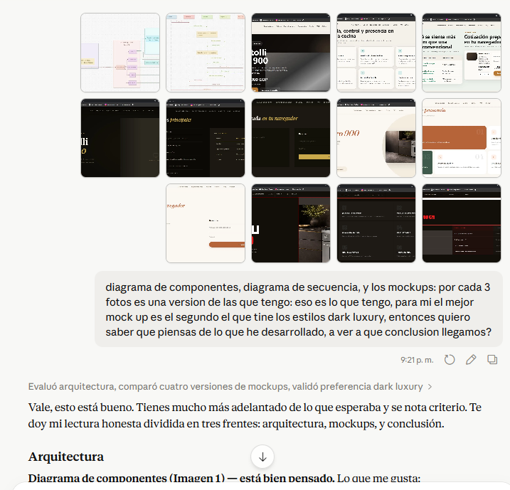
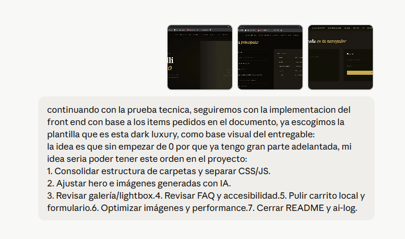

el dia de hoy estoy desarrollando una prueba tecnica de frontend, el entregable principal es una lading page premium para una tienda ficticia, que se dedica a vender un producto que es una cocina a gas profesional de 5 hornillas, segun el documento estos son los requerimientos de la prueba tecnica: Stack obligatorio del entregable principal:

HTML5
CSS3
JavaScript vanilla
Sin frameworks
Deploy en Vercel/Netlify/GitHub Pages
README
Log de conversaciones con IA
La landing ya está planteada con:

Hero premium
Features
Galería con lightbox
Especificaciones técnicas
FAQ accesible
CTA con WhatsApp y formulario
Footer
Dark mode con localStorage
Animaciones CSS
prefers-reduced-motion
Open Graph
Carrito local con localStorage
Chatbot local con corpus del producto, pero yo quisiera ir mas alla, quiero proponer un CRUD para que el front end se conecte a un backend en python y una base de datos en supabase, con el fin de poder tener una planeacion progresiva, implementar una conexion de pagos con stripe para hacer la simulacion de la compra en linea, ademas quiero dejar funcionando con una asistente que resuleva las dudas del cliente sobre la cocina y de los puntos fuertes de por comprar nuestro producto y no la competencia por medio de una conexion de VPS de un LLM dedicado a la tienda o la usar un key API para usar gemini 2.0 como modelo principal por openrouter que son las practicas con las que he trabajado, a su vez implementar el RAG en supabase aprovechando el supabase vector emulando un elastic search mas artesanal, es como lo que yo quiero proponer para la solucion, entonces que me recomendarias que empiece a desarrollar y si la arquitectura esta bien definida, a su vez te pasare el documento para que valides si lo que estoy proponiedo es una buena solucion:

----------------------------------------------------------------------------------------------------------------------------------

Te voy a dar mi opinión honesta porque creo que es lo más útil ahora mismo: la arquitectura que estás proponiendo está sobredimensionada para esta prueba y, si la ejecutas tal cual, te juega en contra. Déjame explicarte por qué, basándome directamente en lo que dice el documento.
Por qué tu propuesta tiene problemas
1. Es una prueba de frontend, no fullstack. El stack obligatorio es HTML5 + CSS3 + JS vanilla. El backend en Python, Supabase, Stripe, VPS con LLM y RAG no están en la rúbrica. Cero puntos suman directamente, y sí restan tiempo a lo que sí se evalúa.
2. La rúbrica es muy clara sobre dónde están los puntos:

Calidad del código: 25%
Uso de IA (cómo dirigiste, qué NO delegaste, reflexión): 25%
Diseño visual: 15%
Responsive + a11y: 15%
Performance (Lighthouse ≥90): 10%
Documentación y Git: 10%

Nada de eso premia integraciones backend. El 50% de la nota está en código frontend + cómo usaste la IA. Ahí es donde tienes que ganar.
3. El documento te advierte explícitamente dos cosas que tu plan activa como riesgo:

"Una landing simple pero bien pensada gana contra una landing compleja pero descuidada."
"Está prohibido entregar código que claramente no entiendas... la prueba queda invalidada — incluso si funciona perfectamente."

Con 6-8 horas efectivas y 24 horas de plazo, meter Stripe + Python + RAG + LLM dedicado significa que muchas piezas van a quedar a medias o las vas a copiar sin entenderlas a fondo. Eso es exactamente el perfil "EL QUE COPIA" que ellos rechazan.
4. Ya tienes un chatbot local con corpus del producto. Reemplazarlo por un LLM remoto con RAG no aporta valor evaluable y duplica trabajo. El chatbot local, bien hecho, ya demuestra criterio técnico.
Qué te recomendaría priorizar
Hoy (orden estricto):

Pulir la landing al máximo. Que el HTML semántico esté impecable, el CSS sin !important, el JS modular. Que Lighthouse marque ≥90 en las 4 métricas, no solo performance.
Hacer el README excelente. La sección "Mi flujo con IA" es 25% de la nota. Las 3 conversaciones exportadas deben mostrarte rechazando sugerencias de la IA, no aceptándolas todas.
Identificar bien el fragmento // HUMAN ONLY:. Que sea algo no trivial: una animación CSS específica, la lógica del lightbox con manejo de focus para accesibilidad, el sistema de variables CSS del design system. Algo que puedas defender oralmente.
Commits descriptivos. No un commit "final". Que se vea tu proceso.

Si te sobra tiempo (bonus que sí están en el documento):

Calculadora de cuotas (vanilla JS, súper alineada con el producto premium).
Comparador con la competencia (Smeg, Bosch) — esto sí impacta venta.
Testimonios.
Micro-interacciones con prefers-reduced-motion bien implementadas.

Sobre tu idea original
Lo que estás proponiendo (Python + Supabase + Stripe + RAG + LLM dedicado) es un proyecto fullstack real de 2-3 semanas, no una prueba de 24 horas. Es buena idea para tu portafolio personal después, pero no la metas aquí. Si quieres mostrar que sabes pensar en arquitectura, hazlo en el README:

"Sección 'Qué mejoraría si tuviera más tiempo': describiría aquí cómo evolucionaría esto a un sistema con backend en Python + Supabase para CRUD de productos, Stripe para pagos, y RAG sobre supabase-vector para un asistente de ventas. No lo implementé porque la prueba evalúa frontend en 24h y prioricé la calidad del entregable principal."

Eso demuestra criterio — que es justo lo que dice el documento que están buscando ("EL DIRECTOR"). Demuestras que conoces la arquitectura sin gastar las horas en construirla a medias.

----------------------------------------------------------------------------------------------------------------------------------

pero pues es que yo no voy a empezar de 0, yo lo propongo es por que yo ya tengo codigo desarrollado por mi en otros proyectos, entonces puedo reclicar codigo de mis otros proyectos y orientarlo a este, por ejemplo con el tema de los modelos yo siempre lo reentreno con el contexto de mi actividad y los publico por ejemplo para agrosoft cm que es mi proyecto principal tengo el modelo asi, he insvestigado que hay version gratuitas con openrouter pero no me gustan tanto por que no quedan como modelos dedicados sino que son mas generales entonces los uso pero para pruebas rapidas como la de hoy, quisiera entender donde esta la complejidad tan alta si yo tengo las herramientas adelantadas bro

----------------------------------------------------------------------------------------------------------------------------------

Tienes razón en una cosa importante y te debo la corrección: si reciclas código tuyo que dominas, el "esfuerzo de escribir" baja muchísimo. Ahí mi argumento de "te toma 2-3 semanas" no aplica. Pero la complejidad no está donde tú la estás midiendo. Déjame explicarte dónde sí está, y luego tú decides.
Dónde está la complejidad real (aunque tengas el código)
1. Integración, no escritura. Aunque el backend de agrosoft te lo lleves entero, tienes que: adaptar el esquema de Supabase al producto Bertolli, recablear endpoints, manejar CORS entre el deploy del front (Vercel) y el del back, env vars, webhooks de Stripe, estados de éxito/error en el front, modo test de Stripe, y testing end-to-end del flujo. Eso son horas reales aunque el código base exista.
2. Superficie de despliegue. Ahora tienes 2 deploys que tienen que estar arriba a las 11pm cuando el evaluador abra el link: Vercel (front) + Render/Railway/Fly (back) + Supabase + Stripe en test mode + tu LLM dedicado en el VPS. Si cualquiera de esos 5 se cae cuando lo prueban, tu landing se ve rota. Una landing estática en Vercel no se cae nunca.
3. Alineación con la rúbrica — esto es lo más importante. Aunque te ahorres tiempo reciclando, el tiempo ahorrado no se traduce en puntos extra automáticamente, porque la rúbrica no premia backend:

25% calidad de código frontend
25% cómo usaste la IA + reflexión escrita
15% diseño
15% responsive + a11y
10% Lighthouse
10% README + Git

Si te ahorras 3 horas con código reciclado del backend, esas 3 horas convertidas en pulir CSS, escribir una mejor reflexión de IA, o hacer pruebas de accesibilidad con teclado, sí suben tu nota. Las mismas 3 horas en integrar Stripe no.
4. Carga del README. La sección "Mi flujo con IA" (25%) compite por tu atención con: documentar arquitectura Python, schema de Supabase, cómo correr el back localmente, env vars, decisiones del RAG. Mientras más sistemas, más README, y el README clave (el de IA) puede quedar superficial.
5. La señal de criterio. El documento es explícito: buscan "EL DIRECTOR" — alguien que sabe cuándo NO hacer algo. Si el evaluador piensa "este montó un backend para una landing estática de un producto ficticio sin checkout real", esa es señal negativa de criterio incluso si todo funciona. Aunque a ti te tome 4 horas, a sus ojos parece que no entendiste el brief.
Lo que sí podría tener sentido (versión intermedia)
Si quieres mostrar capacidad extra sin disparar los riesgos:

Stripe en modo test con Stripe Checkout directo (sin backend Python, usando solo el client-side de Stripe). Esto demuestra "sé integrar pagos" con una superficie mínima. 1-2 horas.
El chatbot con tu LLM dedicado, sin RAG. Reemplazas el chatbot local por el tuyo del VPS. Documentas el corpus en el README. Si quieres mencionar RAG, lo describes como "evolución futura" en la sección "Qué mejoraría con más tiempo".
Saltarte el Python backend + Supabase CRUD completo. Para una landing de un solo producto ficticio, un CRUD no aporta al storytelling de venta. No hay catálogo. No hay usuarios.

Antes de seguir, dos preguntas honestas
Para darte una recomendación más concreta necesito saber:

¿En qué punto está la landing hoy? ¿Ya está terminada y pulida, o todavía estás iterando diseño/contenido? Si todavía no está fina, ahí están los puntos garantizados.
¿Cuál es tu objetivo real? ¿Pasar esta prueba específicamente, o mostrar habilidades fullstack pensando que eso te diferencia para el rol? Porque la respuesta cambia: si es pasar, optimiza para la rúbrica. Si es diferenciarte, hay formas más seguras (README excepcional, decisiones de IA brillantes, un detalle de UX único).

Cuéntame esos dos puntos y te aterrizo qué vale la pena meter de lo tuyo reciclado y qué no.

----------------------------------------------------------------------------------------------------------------------------------

diagrama de componentes, diagrama de secuencia, y los mockups: por cada 3 fotos es una version de las que tengo: eso es lo que tengo, para mi el mejor mock up es el segundo el que tine los estilos dark luxury, entonces quiero saber que piensas de lo que he desarrollado, a ver a que conclusion llegamos?

----------------------------------------------------------------------------------------------------------------------------------

Vale, esto está bueno. Tienes mucho más adelantado de lo que esperaba y se nota criterio. Te doy mi lectura honesta dividida en tres frentes: arquitectura, mockups, y conclusión.
Arquitectura
Diagrama de componentes (Imagen 1) — está bien pensado. Lo que me gusta:

La separación frontend obligatorio / backend opcional / servicios externos está clara. El "si está configurado" en la flecha hacia API REST es la decisión correcta: el front funciona standalone si el back no está.
El Fallback local (corpus + localStorage) es la jugada inteligente del diagrama. Demuestra que pensaste en degradación: si OpenRouter falla, si el VPS se cae, si te tumban la API key, el asistente sigue respondiendo. Eso es pensamiento de producción, no de demo.
Marcar pgvector como "futuro RAG" es correcto. Te ahorra discusiones sobre por qué no lo implementaste hoy.
Tener modelo principal + respaldo + refuerzo en OpenRouter muestra que entiendes resiliencia y costos diferenciados (Gemini Flash barato → DeepSeek R1 solo para preguntas complejas).

Lo que falta o mejoraría:

No veo el flujo de leads y formulario de contacto conectado al backend. Si vas a documentar este diagrama, agrega la flecha desde "Landing page" hacia "Leads".
El bloque "Fallback local" debería tener una flecha desde el "Asesor inteligente" indicando "si API REST no responde → fallback". Como está, parece un componente paralelo, no un degradado.

Diagrama de secuencia (Imagen 2) — bien estructurado pero incompleto. Lo que está perfecto:

Cálculo del total en el servidor, no en el cliente. Esto es básico de seguridad y muchos lo olvidan.
Validación de producto en Supabase antes de crear la sesión de Stripe.
Crear "orden pendiente" antes del checkout, no después.

El hueco crítico: no hay webhook de Stripe → Backend para confirmar pago completado. Hoy mismo en tu diagrama, el "Completar pago" entre Cliente y Stripe deja al backend sin saber si la orden pendiente debe pasar a "completada", "fallida" o "abandonada". En producción real, sin webhook, no tienes reconciliación. Si vas a explorar la rama de Stripe, agrega esa flecha. Si no, déjalo documentado como deuda técnica reconocida.
Mockups
Te voy a dar mi orden de preferencia técnica y luego comparo con el tuyo:
Versión 4 (rojo + negro) — la descartaría. El rojo es problemático para premium: lo asociamos a sale, descuento, urgencia agresiva. Es buen color para Coca-Cola o un Ferrari, pero para una cocina premium de $4.990.000 COP rompe el posicionamiento. El brief pidió inspiración en Smeg/Bosch/KitchenAid: ninguna usa rojo dominante.
Versión 1 (crema + cobre) — funciona pero es la más genérica. Se ve correcta pero no memorable. Le falta personalidad.
Versión 2 (dark luxury, tu favorita) — es la más premium en sensación. Lo que está muy bien:

La tipografía serif itálica para Pro 900 contrastando con el sans serif de "Bertolli" es un move sofisticado, típico de marcas como La Cornue o Gaggenau.
La paleta negro + dorado + crema oscuro tiene cohesión.
La página de especificaciones (Imagen 7) está bien resuelta: ficha técnica a la izquierda en líneas finas, comparador a la derecha en bloque oscuro. Buena jerarquía.

Pero tiene problemas que tienes que resolver antes de entregar:

El hero está vacío. En la Imagen 6 hay un rectángulo gris donde debería ir la cocina. Sin imagen del producto en el hero, una landing premium se ve como un wireframe. Esto es urgente.
Contraste AA en riesgo. Dorado sobre fondo negro puede fallar WCAG AA dependiendo del tono exacto del dorado. La rúbrica pide accesibilidad AA — verifícalo con Lighthouse o WebAIM Contrast Checker. Si falla, ajusta el dorado a un tono más claro.
Estado vacío del carrito (Imagen 8) se ve débil. "No hay productos agregados" en un fondo tan oscuro sin ilustración ni call-to-action visual hace que parezca rota. Considera un estado vacío más cuidado.
El asesor (Imagen 6) compite visualmente con el contenido principal. En dark luxury, el botón flotante dorado grande puede sentirse intrusivo. Considera hacerlo más sutil o colapsarlo por defecto.

Versión 3 (crema + terracota + features numerados) — y aquí viene mi parte incómoda: técnicamente, esta es la que más se acerca al brief. El brief dice explícitamente "inspírate en Smeg, Bosch, KitchenAid". Ninguna de esas marcas es dark luxury — son claras, con fotografía real de producto, espacios amplios. La v3 tiene la foto real de la cocina en el hero, el grid asimétrico de features con un bloque resaltado en terracota y otro en verde es distintivo, y el uso de fotografía de lifestyle se siente más "Smeg moderno".
Mi conclusión honesta
v2 (tu elección) es defendible pero requiere articularla. Es la propuesta más premium en sensación, pero te aleja de las marcas que el brief cita como inspiración. Si la entregas, en el README necesitas un párrafo del tipo:

"Aunque el brief sugiere Smeg/Bosch/KitchenAid como referencia, opté por un posicionamiento más cercano a Gaggenau / La Cornue / Officine Gullo — marcas de cocinas profesionales de gama ultra-alta donde el dark luxury y la tipografía serif itálica refuerzan exclusividad. La justificación es que el precio ($4.990.000 COP) y la promesa ("línea profesional") apuntan a un comprador que valora distinción visual sobre familiaridad."

Eso convierte la decisión de algo que el evaluador podría leer como "no siguió el brief" a "interpretó el brief con criterio y conoce el espacio de marcas".
Si quieres jugar más seguro, v3. Está más alineada al brief literal, tiene fotografía real del producto, y el grid asimétrico con colores diferenciados es distintivo. Es la versión que un evaluador puede premiar sin tener que pensar dos veces.
Mi voto, si pudiera elegir: v2 con la siguiente cirugía — meter la fotografía dramática del producto en el hero (cocina sobre fondo oscuro, iluminación lateral, estilo editorial), arreglar el estado vacío del carrito, validar contraste AA, y defender la decisión en el README como te propuse arriba.
Próximos pasos concretos

Hoy: arregla el hero de v2 con imagen real del producto. Es la decisión más urgente.
Validación a11y: corre Lighthouse en v2 y verifica contraste AA específicamente en el dorado sobre negro.
README: escribe ya el párrafo de "decisiones de diseño" defendiendo dark luxury vs el inspirador del brief. Hazlo antes de que se te olvide la lógica.
Diagrama de secuencia: agrega la flecha de webhook Stripe → Backend, aunque sea para documentar la deuda. Si lo dejas como está, alguien técnico lo va a ver y va a pensar "no entiende pagos".
Componente diagrama: agrega la flecha Landing → Leads y la del fallback desde Asesor.
Lo que NO debes hacer: no abras una rama de Stripe real ni de FastAPI todavía. Termina v2 primero. Los diagramas, por sí solos, ya te suman puntos en "decisiones técnicas" del README sin que tengas que implementarlos.

----------------------------------------------------------------------------------------------------------------------------------
continuando con la prueba tecnica, seguiremos con la implementacion del front end con base a los items pedidos en el documento, ya escogimos la plantilla que es esta dark luxury, como base visual del entregable: 
la idea es que sin empezar de 0 por que ya tengo gran parte adelantada, mi idea seria poder tener este orden en el proyecto: 
1. Consolidar estructura de carpetas y separar CSS/JS.
2. Ajustar hero e imágenes generadas con IA.
3. Revisar galería/lightbox.4. Revisar FAQ y accesibilidad.5. Pulir carrito local y formulario.6. Optimizar imágenes y performance.7. Cerrar README y ai-log.

----------------------------------------------------------------------------------------------------------------------------------

El orden está bien pensado en términos generales — va de estructura a contenido a pulido, que es la secuencia correcta. Pero antes de validarlo del todo hay un detalle que me llamó la atención mirando las capturas y vale la pena resolver primero, porque si no lo arreglas en el paso 1 vas a arrastrarlo hasta el final.
Lo que veo raro en las capturas
Las tres URLs apuntan a 127.0.0.1:5500/ai-log/asistente.html. Eso significa que el HTML del producto está viviendo dentro de la carpeta /ai-log/. Esto es un problema, porque la rúbrica RCKT pide explícitamente que /ai-log/ sea únicamente la carpeta donde van los exports de las conversaciones con IA (3+ archivos .md/.txt/.pdf). Si el evaluador abre tu repo y ve código de la landing mezclado con transcripts en la misma carpeta, va a interpretarlo como descuido — y eso pega contra "Docs + Git" (10%) y contra la percepción general de orden.
Tu paso 1 entonces no es solo "separar CSS/JS", es también mover el HTML a la raíz y dejar /ai-log/ limpia para lo que es. La estructura objetivo según el brief es:
/index.html
/css/
/js/
/assets/        ← imágenes (WebP/AVIF)
/ai-log/        ← solo conversaciones exportadas
README.md
Validación de tu orden
El orden 1→7 está bien con dos ajustes:
El paso 6 (optimizar imágenes) llega tarde. Si en el paso 2 metes el hero con un PNG de Sora sin optimizar, y luego en la galería del paso 3 metes 4 imágenes más sin optimizar, cuando llegues al paso 6 vas a tener que reemplazar todo y revalidar layout shift en cada sección. Mejor convención: al insertar cualquier imagen, ya viene en WebP/AVIF desde Squoosh. El paso 6 queda entonces como "validar Lighthouse ≥90 y ajustar lo que falle", no como "ahora sí optimizar todo".
La accesibilidad (paso 4) no debe ser solo de FAQ. El acordeón es lo más obvio, sí, pero la rúbrica AA cubre toda la página: contraste dorado/negro (que ya tienes pendiente), navegación por teclado en el lightbox, focus visible, labels en el formulario, alt text en imágenes, aria-expanded en FAQ. Renómbralo a "Revisar FAQ y pasar a11y completa" para que no se te escape.
Lo que falta como paso explícito
Git, commits descriptivos y la rama experimental/*. No aparece en tu lista y vale 10% directo. Mi sugerencia: cada paso de tu lista cierra con un commit con mensaje descriptivo en develop, y al final mergeás a main con un PR. Esto solo, hecho con disciplina durante las 6-8 horas, te diferencia de "EL QUE COPIA" sin trabajo adicional real.
El comentario // HUMAN ONLY: en algún fragmento no trivial. Eso no es un paso, es algo que debes marcar a medida que escribes código. Mi recomendación: márcalo en el carrito local (paso 5) o en la lógica del lightbox (paso 3), que son los lugares donde es creíble que tomaste decisiones de implementación propias.
Screenshot de Lighthouse para el README. Va en el paso 7, pero solo después de validar en el 6.
Mi propuesta de orden refinado

Reestructurar carpetas — mover HTML fuera de /ai-log/, separar CSS/JS, dejar /assets/ lista. Commit: chore: estructura inicial de carpetas según brief.
Hero + imagen Sora ya optimizada a WebP. Commit: feat(hero): integra imagen principal y ajusta layout.
Galería + lightbox con 4+ imágenes WebP, navegación teclado. Marca // HUMAN ONLY: aquí si la lógica del lightbox es tuya.
FAQ + a11y transversal — acordeón con aria-expanded, contraste AA verificado en WebAIM, focus visible, labels, alts.
Carrito y formulario — estado vacío decente (pendiente registrado), validación de campos, mensaje WhatsApp con plantilla.
Lighthouse ≥90 — corre, identifica qué falla, ajusta. Si performance flojea, el culpable suelen ser fuentes de Google sin display=swap o imágenes sin width/height.
README + ai-log — screenshot de Lighthouse, sección "Mi flujo con IA", exportar 3 conversaciones a /ai-log/, PR de develop → main.